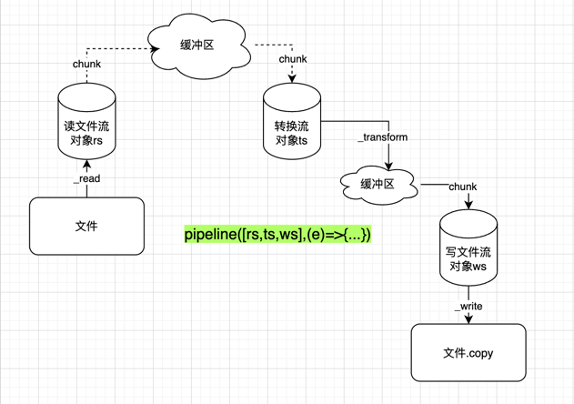

# Stream 例子

## stream都有哪些事件，分别执行先后顺序是怎样的？

参考：[01-stream-events.js](01-stream-events.js)

## stream要如何关闭？在什么情况下要关闭？

1. `readAble.pipe(xxx)` 时，需要监听read的事件，随后进行主动关闭
2. `pipeline`的时候，会自动关闭，无须担心

参考：[02-pipe-pipeline.js](02-pipe-pipeline.js)

## pipe和pipeline的区别？

- pipe 是一个可读流（包括双向流）的一个方法，可以把当前可读流和目标流绑定在一起。
- pipeline 是一个函数，函数可以把参数中的流按照顺序全部绑定在一起

不同的地方：

- pipe 只会让每个流监听自己的错误

例如：a.pipe(b),若a出现错误，则b不会监听到错误

- pipeline，会让每个流中的错误，触发到其他的流中，

例如： pipeline(a,b,c)，此时a流出现错误，则`b.on('error,err=>{...})`也会收到相关信息，c流同理。

